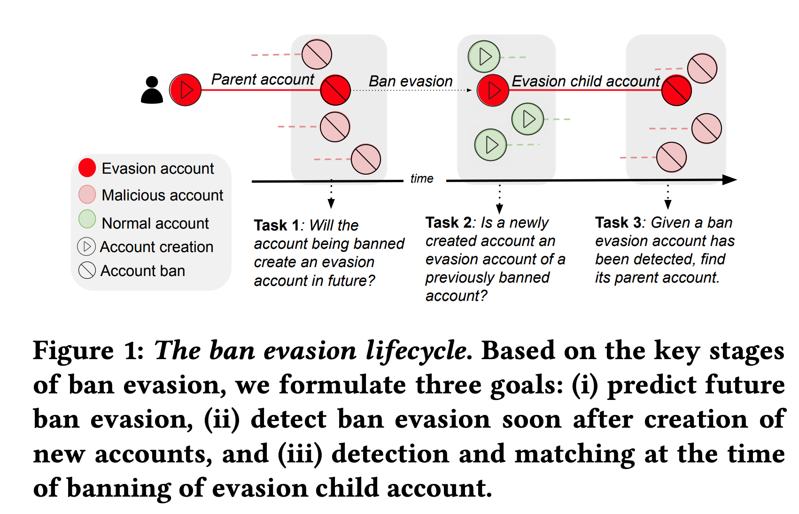

# Characterizing, Detecting, and Predicting Online Ban Evasion [[pdf]](TODO)
## Authors: [Manoj Niverthi](https://www.linkedin.com/in/manojniverthi)\*, [Gaurav Verma](https://gaurav22verma.github.io/)\*, [Srijan Kumar](https://faculty.cc.gatech.edu/~srijan/) | ([CLAWS](http://claws.cc.gatech.edu/) @ [Georgia Tech](https://www.gatech.edu/))
### Code and data used in the paper accepted at The ACM Web Conference (WWW 2022)

Paper: [arXiv](TODO)  
Slides: [soon](TODO)   
Video: [soon](TODO)  
BibTeX: 
```
@inproceedings{niverthi2022banevasion,
  title={Characterizing, Detecting, and Predicting Online Ban Evasion},
  author={Niverthi, Manoj and Verma, Gaurav and Kumar, Srijan},
  booktitle={Proceedings of the Web Conference 2022},
  year={2022}
}
```

## Wikipedia Ban Evasion Dataset
We curated a dataset comprising **8,551 ban evasion pairs on Wikipedia**, where each pair comprises a parent account and the child account. We adopt a strategy to ensure that there is a 1:1 mapping between parent and child accounts. For each of the accounts in these ban evasion pairs, we provide the following data:  
* Wikipedia usernames, creation date, ban date, and other account-level meta-data
* Corresponding edit information in form of revision IDs, pages edited, added text, deleted text, edit comment, and timestamp  

The main dataset comprising these ban evasion pairs is stored in `./final_data/ban_evasion_pairs/`. The directory contains the meta-data about these pairs in the file named `evasion_pairs_meta.csv`, and the subdirectories `user_contribs/` and `revision_text/` contain the revision IDs for each account in the CSV and the revision content (i.e., pages edited, added text, deleted text, edit comment, and timestamp) for the revision IDs, respectively. 

**Note**: Since the original dataset size is around 33 GiB (compressed in a .zip folder), we only share a very small fraction of the original data as sample here on GitHub. The complete dataset can be found at this [Dropbox link](https://www.dropbox.com/s/eu94970fp1eo8kx/data.zip?dl=0). The full data is organized in the same manner as the sample provided here. Please contact the authors if you face any access issues. 

## Lifecycle-based Matched Pairs

Furthermore, to analyze the behavioral traits of ban evaders, we carefully constructed *'control groups'* to conduct controlled comparisons. We also refer to these pairs as *'matched pairs'* in the paper. For each part of the ban evasion lifecycle that we are analyzing, we construct a new set of control users. 

<center></center>

### Task 1: Evasion prediction
The question is: _whether we can distinguish a malicious parent account that is known to create an evasion account later on from a malicious account that does not create an evasion account_. The control group here comprises malicious accounts that were banned around the same time as the the malicious parent. The dataset for this part of the lifecycle is included in `./final_data/task1/`. The directory contains the meta-data about the matched malicious accounts (along with the username of the true parent it was matched with) in the file names `task1_matched_pairs_meta.csv`. The subdirectories `user_contribs/` and `revision_text/` contain the revision IDs for each matched account in the CSV and the revision content (i.e., pages edited, added text, deleted text, edit comment, and timestamp) for the revision IDs, respectively.

### Task 2: Early Evasion Detection 
The relevant question for this task is: _given an account that was just created, determine if it is the child of a previously banned account_. It is important to note that this is a pairwise task -- samples analyzed in this task involve pairs of accounts. The experimental group of accounts involves known ban evasion pairs, while the control group consists of true ban evasion parents that have been matched with normal accounts created at around the same time as the true ban evasion child. To ensure that the account history was consistent with the timeline approach that we were aiming to create, we exclusively considered the first 3 edits that the child account made in order to simulate the fact that this experiment was done _early_ in the child account's lifespan. The dataset for this part of the lifecycle is included in `./final_data/task2/`. The directory contains the meta-data about the matched malicious accounts (along with the username of the true parent it was matched with) in the file names `task2_matched_pairs_meta.csv`. The subdirectories `user_contribs/` and `revision_text/` contain the revision IDs for each matched account in the CSV and the revision content (i.e., pages edited, added text, deleted text, edit comment, and timestamp) for the revision IDs, respectively.

### Task 3: Ban-time Evasion Detection and Attribution
In this task, we aim to find: _given an account that has been reported to engage in malicious activity, identify whether it is an evasion child account or an isolated account_. In the case that the account is an evasion account, we aim to formulate a related attribution task: _if the account is an evasion child account, identify its parent account_. In this pairwise task we had an experimental group of true ban evasion pairs and a control group of pairs that consisted of true ban evasion parents that were paired with non-evading malicious users (accounts that were banned but _not_ for instances of evasion) that were created at around the same time as the true ban evasion child. The dataset for this part of the lifecycle is included in `./final_data/task3a/`. The directory contains the meta-data about the matched malicious accounts (along with the username of the true parent it was matched with) in the file names `task3a_matched_pairs_meta.csv`. The subdirectories `user_contribs/` and `revision_text/` contain the revision IDs for each matched account in the CSV and the revision content (i.e., pages edited, added text, deleted text, edit comment, and timestamp) for the revision IDs, respectively.

The attribution task was done exclusively among true ban evasion pairs. From within the set of true ban evasion pairs, we created artificial pairs by matching true ban evasion children with the 50 true ban evasion parents that were banned most closely to the child account's creation. We then had the model rank these accounts based on their class probability score produced by the classification model. The data for this task is in `./final_data/task3b/`, with the accounts being in the file `task3b_matched_pairs_meta.csv`. The dataset used in this task corresponds to that of `./final_data/ban_evasion_pairs/` since we are just performing mismatching between true pairs.
